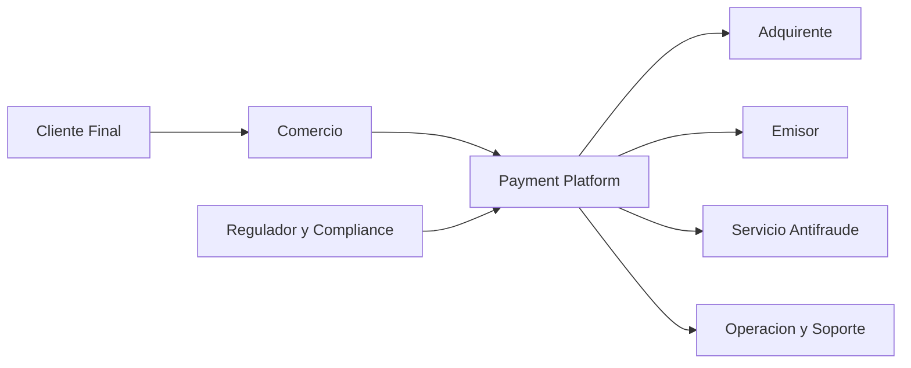
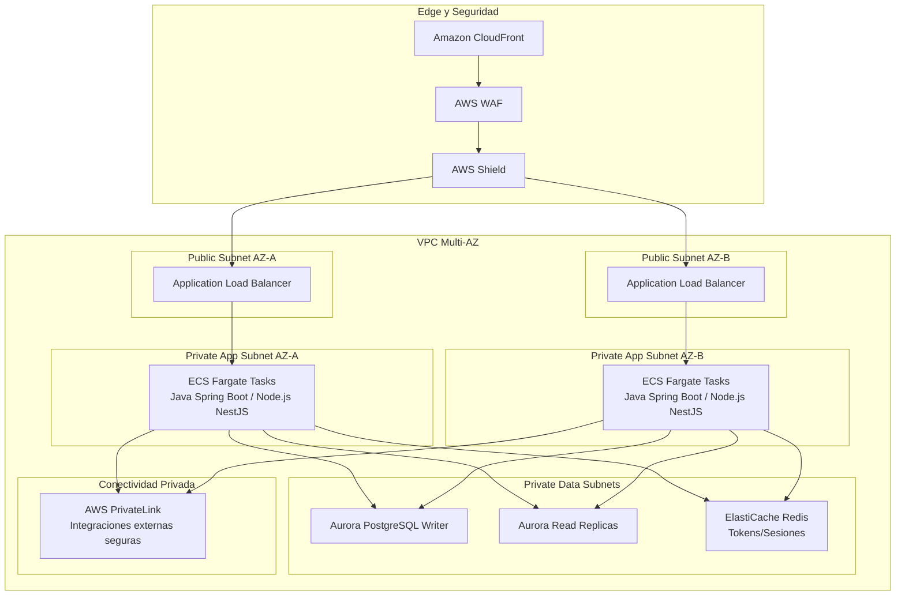

# 01-architecture-overview

## Objetivo

Definir una arquitectura de referencia en AWS para una plataforma de pagos transaccional de alta criticidad, con foco en disponibilidad, latencia y cumplimiento.

## C4 Context

## Arquitectura AWS detallada

## Decisiones clave

- CloudFront se usa para reducir latencia de entrada, proteger el edge y centralizar politicas.
- ALB distribuye trafico HTTP/HTTPS con health checks hacia tareas ECS en subredes privadas.
- ECS Fargate desacopla operacion de contenedores de la gestion de nodos.
- Aurora PostgreSQL ofrece alta disponibilidad en Multi-AZ y replicas para lectura.
- ElastiCache Redis reduce latencia para tokens, sesiones y datos de acceso frecuente.
- PrivateLink limita exposicion de integraciones criticas al evitar trafico publico.

## Trade-offs: ECS Fargate vs EKS

Ventajas de ECS Fargate para este caso:
- Menor complejidad operativa inicial y menor carga de plataforma.
- Time-to-market mas rapido para equipos de delivery con foco en producto.
- Integracion nativa simple con ALB, IAM roles for tasks, CloudWatch y autoscaling.

Costos/limitaciones frente a EKS:
- Menor flexibilidad para patrones avanzados de scheduling y custom controllers.
- Menor portabilidad de practicas Kubernetes nativas.
- Menos control fino de runtime comparado con un cluster EKS maduro.

Criterio de seleccion:
- Para una organizacion que prioriza velocidad de adopcion, gobierno estandar y bajo overhead operacional, ECS Fargate es la opcion mas eficiente.
- EKS se evalua cuando la escala de equipos/plataforma justifica operar Kubernetes como capacidad central.

## Relacionado

- [02 - Infrastructure as Code](02-infrastructure-as-code.md)
- [03 - Security and Compliance](03-security-and-compliance.md)
- [04 - Disaster Recovery and Resilience](04-disaster-recovery-and-resilience.md)
- [05 - Cost Optimization and FinOps](05-cost-optimization-finops.md)
- Referencia de governance CI/CD del portfolio: [enterprise-cicd-governance-blueprint](https://github.com/andminin-engineering/enterprise-cicd-governance-blueprint)
